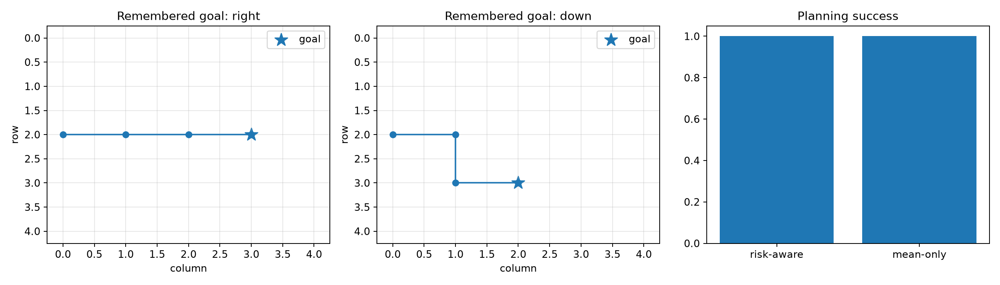
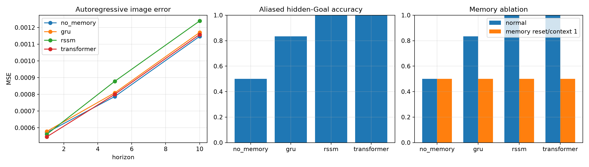

# World Model研究

論文で提案されてきたWorld Modelの主要な機構を、小さく再現可能な実験として一つずつ理解・実装し、最後に実験結果を根拠として統合する研究リポジトリです。

```text
Observation
  ↓
Representation / Perception
  ↓
Memory and Belief State
  ↓
World Dynamics and Uncertainty
  ↓
Future Imagination
  ↓
Reward / Value Prediction
  ↓
Planning / Policy
  ↓
Guarded Action
```

単に「コードが動く」ことを完了条件にしていません。各実験には数式とコードの対応、各lossの役割、部品を除去した場合の影響、失敗例、元論文との差分を記録しています。

## 現在の状態

2026-08-23時点で、MemoryからPhysical AI、統一評価、統合World Modelまでの一気通貫フェーズが完了しています。

- 31 experiment directories
- 131 tests passing
- 24 executable evaluation artifacts
- No Memory / GRU / RSSM / Transformerの3-seed統一比較
- 部分観測画像からMPC actionまで接続した統合World Model
- 各実験のREADME、理解教材、研究ノート、metrics、可視化

進捗の詳細は[RESEARCH_ROADMAP.md](RESEARCH_ROADMAP.md)、論文の状態と出典は[PAPERS.md](PAPERS.md)で管理しています。

## 初めて読む方へ

このリポジトリでは、難しい言葉を次のように考えると読み進めやすくなります。

| 言葉 | まずはこう捉える |
|---|---|
| Observation（観測） | Agentがカメラなどから実際に受け取る情報。世界全体ではない場合がある。 |
| State（状態） | 本当の世界の情報。環境内部は持っていても、Agentには見えないことがある。 |
| Latent `z` | 画像をそのまま扱わず、重要な情報を小さな数値ベクトルに圧縮した表現。 |
| Memory / hidden state `h` | 過去の観測とactionを要約して持つ内部メモ。 |
| World Model | 「この状態でこのactionをしたら、次に何が起きるか」を予測するmodel。 |
| Prior / Posterior | 画像を見る前の予測 / 画像を見た後に修正した推論。 |
| Rollout / Imagination | model内部だけで未来を何stepも予測すること。 |
| Planning | 未来をいくつか想像し、良さそうなactionを選ぶこと。 |

最初はすべてを理解する必要はありません。次の順で読むと、部品が必要になる理由を段階的に追えます。

よりゆっくり、実際のGrid Worldの例からMemoryを学ぶ場合は、まず[03_memory/START_HERE.md](03_memory/START_HERE.md)だけを読んでください。数式や論文を先に読む必要はありません。

学んだ内容を一つの記事として読み返す場合は、[03_memory/ARTICLE.md](03_memory/ARTICLE.md)を読んでください。

1. [`03_memory/01_gru`](03_memory/01_gru/README.md): まず過去を覚えるGRUを作る。
2. [`03_memory/02_partial_observation`](03_memory/02_partial_observation/README.md): なぜ現在画像だけでは足りないのかを体験する。
3. [`03_memory/03_rssm`](03_memory/03_rssm/README.md): prior/posteriorとKLを導入する。
4. [`90_evaluation/01_memory_benchmark`](90_evaluation/01_memory_benchmark/README.md): 同じ条件で比較して採否を決める。
5. [`99_integrated_world_model`](99_integrated_world_model/01_evidence_selected/README.md): 有効だった部品を接続する。

## 統合World Model

Phase 99では、過去の実験で有効性または必要性を確認できた機構を選択して統合しました。「実装したものを全部入れる」のではなく、失敗した機構や現在の課題に不要な機構は保留しています。

```text
partial image o_t ── CNN encoder ── e_t
                                    │
previous z + action ── GRUCell ── h_t
                                    │
                  ┌─────────────────┴──────────────┐
                  │                                │
          posterior q(z_t|h_t,e_t)       ensemble prior p_k(z_t|h_t)
                  │                                │
               [h_t,z_t]                   imagined [h_t,z_t]
                  │                                │
       decoder + task heads         reward/value + disagreement
                                                   │
                                  risk-aware random-shooting MPC
                                                   │
                                      discrete action guard
                                                   │
                                             Grid World
```

採用した主な部品：

- CNN image encoder
- deterministic recurrent state `h_t`
- stochastic latent state `z_t`
- RSSM prior / posterior
- 3-head probabilistic prior ensemble
- KL divergenceと3-step latent overshooting
- observation decoder
- reward / value / continuation / hidden-Goal heads
- risk-adjusted discrete random-shooting MPC
- action validation boundary

統合モデルの詳細：

- [Technical README](99_integrated_world_model/01_evidence_selected/README.md)
- [Understanding Guide](99_integrated_world_model/01_evidence_selected/UNDERSTANDING.md)
- [Component Decision Record](99_integrated_world_model/01_evidence_selected/COMPONENT_DECISIONS.md)
- [Research Notes](99_integrated_world_model/01_evidence_selected/NOTES.md)



## 主な結果

### Memoryの比較

Partial Observation環境では、同じ現在観測でも過去に見たGoalが異なるpaired aliasを作りました。現在frameだけを使うモデルはGoalを区別できず、memory modelは履歴を利用できました。

| Model | Hidden-Goal accuracy | Memory ablation | CPU latency, batch 16 | Parameters |
|---|---:|---:|---:|---:|
| No Memory | 0.500 ± 0.000 | 0.500 | 1.95 ms | 336,994 |
| GRU | 0.833 ± 0.236 | 0.500 | 4.55 ms | 356,418 |
| RSSM | **1.000 ± 0.000** | 0.500 | 4.48 ms | 397,202 |
| Transformer | **1.000 ± 0.000** | 0.500 | 8.05 ms | 405,186 |

この結果から、短い部分観測系列を扱う統合モデルには、Transformerと同じGoal精度でlatencyが小さく、prior/posteriorによるimagination interfaceを持つRSSMを採用しました。



### 入力から行動までをつないだplanning

Goalを視界外へ隠した後のclosed-loop navigationで、次の結果を得ました。

| Planner | Success | Mean steps |
|---|---:|---:|
| Risk-aware MPC | 40 / 40 | 3.0 |
| Mean-only MPC | 40 / 40 | 3.0 |

両方式が全成功したため、この簡単なin-distribution環境ではrisk penaltyの優位性は示されていません。OOD、transition noise、hazardを含む環境での検証が必要です。

### 失敗結果として残したもの

期待と異なる結果も削除せず、次の研究課題として保存しています。

- GRUは3 seed中1 seedでhidden Goalの学習に失敗した。
- Slot Attentionは再構成できたがobject mask IoUは0.271に留まった。
- Latent Action Modelはfuture tokenを予測できたが、真のactionとの対応精度は0.270だった。
- Imagination Actorはworld-model errorを利用し、exact environmentではGoalへ到達しなかった。
- 統合モデルの初稿はposterior/prior feature mismatchにより成功率0.5だった。prior featureにもtask supervisionを与えて1.0へ改善した。

これらは「低いloss」「動くrollout」「高い再構成精度」が、意味のある表現や安全な制御を自動的に保証しないことを示しています。

## 研究フェーズ

| Phase | テーマ | 実験 | 状態 |
|---:|---|---|---|
| 01 | 基本ダイナミクス | 監査時に旧実装を確認できず | 未着手 |
| 02 | 視覚latent | 監査時に旧実装を確認できず | 未着手 |
| 03 | Memory | GRU、部分観測、RSSM、Transformer | 完了 |
| 04 | 不確実性 | Probabilistic Dynamics、Ensemble、PETS-style rollout | 完了 |
| 05 | 長期予測 | Latent Overshooting、Temporal Abstraction | 完了 |
| 06 | Reward / Value | Reward、Value、Continuation head | 完了 |
| 07 | Planning | Random Shooting、CEM、MPC、Latent Planning | 完了 |
| 08 | Imagination RL | Latent Actor-Critic、Dreamer系の資料 | 完了 |
| 09 | 空間表現 | C-SWM、Slot Attention、SlotFormer、3D Occupancy | 完了 |
| 10 | Video World Model | VQ tokenizer、Latent Action、Simulator | 完了 |
| 11 | Multimodal | Vision、Proprioception、Language、Touchの統合 | 完了 |
| 12 | Physical AI | Action-conditioned JEPA、Robot Interface | 完了 |
| 90 | 評価 | 統一Memory比較、System Registry | 完了 |
| 99 | 統合 | 根拠に基づく統合World Model | 完了 |

Phase 01/02を「実装済み」としていない理由は[REPOSITORY_AUDIT.md](REPOSITORY_AUDIT.md)に記録しています。後から旧コードが見つかった場合も、既存実験を上書きせず独立比較します。

## リポジトリ構造

```text
world-model-research/
├── README.md
├── REPOSITORY_AUDIT.md
├── RESEARCH_ROADMAP.md
├── PAPERS.md
├── 03_memory/
│   ├── 01_gru/
│   ├── 02_partial_observation/
│   ├── 03_rssm/
│   └── 04_transformer_memory/
├── 04_uncertainty/
├── 05_long_horizon/
├── 06_reward_value/
├── 07_planning/
├── 08_imagination_rl/
├── 09_spatial_representation/
├── 10_video_world_model/
├── 11_multimodal/
├── 12_physical_ai/
├── 90_evaluation/
└── 99_integrated_world_model/
```

各実験は原則として独立しており、最低限次を含みます。

```text
experiment/
├── README.md          # 技術的・客観的な実験記録
├── UNDERSTANDING.md   # 機構を説明できるようになるための教材
├── NOTES.md           # Zenn記事等へ利用する研究過程の記録
├── outputs/           # metrics、plots、rollouts
└── tests/             # shape、forward、gradient、finite-value等
```

## はじめ方

### 必要な環境

- Python 3.11–3.13
- PyTorch 2.4+
- NumPy 2+
- Matplotlib 3.9+
- `uv` recommended

### セットアップ

```bash
git clone https://github.com/bosakun/world-model-research.git
cd world-model-research
uv sync
```

既存の仮想環境を使う場合は、`pyproject.toml`の依存関係を任意のPython環境へインストールしても構いません。

### 全testを実行する

```bash
uv run pytest -q
```

期待値：

```text
131 passed
```

### 統合モデルを学習・評価する

```bash
MPLCONFIGDIR=/tmp/world-model-mpl uv run \
  python 99_integrated_world_model/01_evidence_selected/train.py

MPLCONFIGDIR=/tmp/world-model-mpl uv run \
  python 99_integrated_world_model/01_evidence_selected/evaluate.py
```

checkpointは`outputs/checkpoint.pt`へ生成されます。サイズの大きなcheckpointはGitで追跡せず、metrics、training history、plotを追跡しています。

### 評価Registryを再生成する

```bash
MPLCONFIGDIR=/tmp/world-model-mpl uv run \
  python 90_evaluation/02_system_registry/build_registry.py
```

生成されるregistry：

- `experiment_registry.json`: 全metricsとprovenance
- `experiment_registry.csv`: compact index
- `evaluation_coverage.png`: phase別の評価artifact数

## 実験の読み方

初めて読む場合は次の順序を推奨します。

1. `README.md`のProblem、Previous Model、Architectureを読む。
2. `UNDERSTANDING.md`で数式、記号、必要性を確認する。
3. `model.py`と`losses.py`をCode Mappingに沿って読む。
4. `tests/`でshapeとinterfaceの期待値を確認する。
5. `outputs/`の結果とfailure caseを見る。
6. `NOTES.md`で、実装前の予想と実際に起きたことの差を確認する。

RSSMから始める場合は[03_memory/03_rssm/UNDERSTANDING.md](03_memory/03_rssm/UNDERSTANDING.md)、プロジェクト全体の結論から始める場合は[Phase 99のREADME](99_integrated_world_model/01_evidence_selected/README.md)が入口です。

## 研究の原則

- 論文由来の機構と独自変更を混同しない。
- 本質的な複雑さを削らず、責務ごとに理解可能な構造へ分ける。
- 一つの仮説・手法を一つの独立フォルダに置く。
- seed、dataset version、shape、hyperparameter、loss、checkpoint formatを残す。
- 新しい手法はmemoryなしのbaselineや前手法と同条件で比較する。
- 仮説と異なる結果、collapse、model exploitationも研究結果として残す。
- 統合時は実装済み機構を全部採用せず、比較結果から選択する。

## 再現性と適用範囲

多くの実験は、重要機構を理解するための小規模な`Simplified educational implementation`です。巨大な論文モデルの完全再現ではありません。各READMEのReferencesに、次を明記しています。

- Title / Authors / Year
- arXiv、DOI、Proceedings URL
- 参考にした機構
- 対応コード
- 省略・変更した点

現時点の制約：

- Phase 90のmemory benchmark以外は主にone-seed smoke experiment。
- 小規模なsynthetic environmentが中心。
- Physical AIフェーズもlocal simulatorのみで、実機へactionを送信していない。
- 統合モデルのuncertainty-aware planning優位性は未証明。
- 学習済みcheckpointはGitに含めず、スクリプトから再生成する。

したがって、ここでの結果をそのまま実世界の性能・安全性へ一般化することはできません。

## 論文の系譜

主な研究系譜：

- World Models / Recurrent World Models
- Auto-Encoding Variational Bayes
- PlaNet / RSSM
- Dreamer / DreamerV2 / DreamerV3
- PETS
- MuZero / TD-MPC2
- TransDreamer
- C-SWM / Slot Attention / SlotFormer
- VQ-VAE / Genie / UniSim
- V-JEPA 2 / DayDreamer / OccWorld

正確な著者、年、primary URL、実装状態は[PAPERS.md](PAPERS.md)を参照してください。

## 次の研究課題

- OOD Goal、障害物、transition noiseを導入するとrisk-aware MPCは有利になるか。
- shared prior headsを独立bootstrap RSSM ensembleへ変更するとcalibrationは改善するか。
- handcrafted distance valueをTD valueへ置き換えてもplanning successを維持できるか。
- Slot Attentionのbinding failureを修正し、object-centric dynamicsへ正しく接続できるか。
- latent actionのidentifiabilityを、prediction精度とは別にどう保証するか。
- simulatorで検証したsafety boundaryを、実機接続前にどう拡張・監査するか。

研究判断の根拠と保留事項は[COMPONENT_DECISIONS.md](99_integrated_world_model/01_evidence_selected/COMPONENT_DECISIONS.md)に集約しています。
